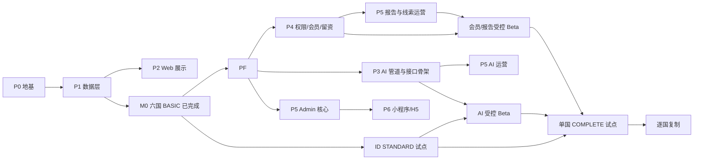

# roadmap.md — 开发路线图与任务卡清单

> 本文件是整体**开发编排的唯一来源**：分阶段依赖、任务卡拆分、人工确认关口。
> 编排由人工把关，Codex 按任务卡逐张执行（AGENTS.md §6「小步交付」、§12「一个任务卡 = 一个 PR」、§13 自检）。
> 数据/接口/覆盖等级/双语/权限/AI 细节以对应 `docs/` 文档为准，本文件不重复定义。

---

## 0. 编排原则

1. **依赖驱动**：地基 → 数据 → 展示 → 智能 → 转化。上游未完成不开工下游。
2. **一张任务卡 = 一个 PR = 一件事**，附测试，独立可验收、可回滚。
3. **人工确认关口**（AGENTS.md §11）在下文用 ⚠️ 标注，Codex 遇到必须停下等 Review。
4. **两处待定项**（AI 系统 Prompt 正式文本、检索边界参数默认值）先用占位跑通管道，定稿后替换，不阻塞开发（见 [ai-advisor.md §4/§5](./ai-advisor.md)）。
5. **当前任务集成路径**：经用户批准，默认执行“本地 feature 分支 → 独立 review → 合并到 `main` → merged-main 验证 → `git push origin main`”，不默认创建 PR。若以后改为 PR 工作流，适用 AGENTS.md 的“一张任务卡 = 一个 PR”规则；本路径不移除合并和推送验收。
6. **六国 BASIC 后并行推进**：六个已批准 BASIC 国家构成平台化启动基线；生产数据库/API/Admin 核心不等待 COMPLETE。单国 STANDARD 试点可经独立人工批准后与平台底座并行，详见 [六国 BASIC 后里程碑设计](./superpowers/specs/2026-07-18-six-basic-platform-milestone-design.md)。

---

## 1. 阶段依赖总览

| 阶段 | 目标 | 主要依据文档 | 关口 |
|------|------|--------------|------|
| P0 地基 | 可运行骨架 + 共享枚举/双语工具 + 环境/CI/文档守卫 | env-config、i18n、testing、data-schema、product-brief | — |
| P1 数据层 | 数据模型落地 + 数据治理校验 + Basic 首次交付 + 覆盖判定 | data-schema、coverage-levels、data-governance、indonesia-seed、country-rollout | ⚠️ |
| P2 Web 展示 | 首页 / 国家 / AI 咨询 / 报告四板块 + i18n | product-brief、api-contract、coverage-levels、i18n | — |
| P2.5 生产平台底座 | 六国数据进入 PostgreSQL/Prisma 生产读取链路 + NestJS API + 运行治理与容量基线 | data-schema、api-contract、env-config、testing、六国里程碑设计 | ⚠️ |
| P3 AI 顾问 | RAG 管道 + 问答接口（占位边界） | ai-advisor | ⚠️ |
| P4 权限/会员/留资 | 门控 + 报告下载 + 留资 | auth-membership | ⚠️ |
| P5 Admin 后台 | 数据管理 + 审核发布 + AI/报告/线索运营 | api-contract、data-schema、data-governance | ⚠️ |
| P6 小程序/H5 | 轻入口复用双语 | i18n | — |

### 1.1 当前执行里程碑（2026-07-18）

| 里程碑 | 当前状态 | 下一步 | 进入下一阶段的必要条件 |
|--------|----------|--------|------------------------|
| M0 六国 BASIC | **已完成** | 保持六国 canonical publication 与批准回执不可变 | ID、VN、SA、AE、BR、ZA 均恰好为 BASIC，且无 AI eligibility |
| M1 生产平台底座 | **进行中：PLATFORM-DB-1 已完成，PLATFORM-API-1 未完成** | 等待 Gate 0 对精确 NestJS 依赖集合的人工批准；批准后完成 PLATFORM-API-1 任务 3–8，再启动 PLATFORM-OPS-1 | 六国幂等导入；数据库/API 返回与 canonical JSON 等价；具备健康检查、可观测性和容量基线 |
| M2 ID STANDARD 试点 | **与 M1 并行进行中：安全合成 fixture 切片已完成** | 在独立人工关口下再推进真实来源登记、事实与双语文本候选；STANDARD 发布另行批准，当前 ID 仍为真实 BASIC | ID 的 policy、risk、opportunities 达到可展示状态并通过 STANDARD 机器判定；来源、事实和发布分别审核；不自动启用 AI |
| M3 Admin 与权限基础 | **M1 后启动** | P5-1、P5-2 与 P4-1、P4-3 按独立任务实施 | 审核发布闭环、服务端鉴权、留资加密均通过测试 |
| M4 AI 受控 Beta | **骨架可在 M1 后开发，生产启用待门槛** | P3-1、P3-2；之后单独执行 AI Beta 启用卡 | 试点已达 STANDARD；ai-advisor 至少 20 个合格片段、覆盖至少 3 个来源模块；Prompt 与检索默认值人工确认 |
| M5 会员与报告受控 Beta | **M3 后开发** | P4-2、P5-4 与真实受控资源试用 | 至少一个真实受控资源；服务端权限矩阵通过；权益与计费边界人工确认 |
| M6 单国 COMPLETE 与复制 | **后续独立批准** | 先执行 `DATA-COMPLETE-<ISO2>`，再按国家拆卡复制 | 试点经独立任务达到 COMPLETE，且 AI/会员相关 Beta 已验收 |

本次里程碑更新已由项目所有者追加选择 ID 并批准 `DATA-STANDARD-ID` 启动；该批准不等于批准具体来源、事实、STANDARD 发布、`aiUsable` 或 COMPLETE 升级。本次仍不修改数据模型、AI Prompt/检索边界、会员权益或计费，也不授权新增依赖或生产部署。

来源、事实、双语文本、STANDARD 发布、`aiUsable`、真实 ID KnowledgeChunk 创建与可检索资格、COMPLETE 升级均须分别人工批准。

---

## 2. 任务卡清单

> 每张卡格式：**目标 / 涉及范围 / 验收标准 / 是否触及「需人工确认」**。
> 任务 ID 用于分支与 PR 命名：`feat/<task-id>-<简述>`（AGENTS.md §12）。

### P0 — 地基

#### P0-1 Monorepo 骨架
- 目标：pnpm workspace + Turborepo，建 `apps/{web,admin,mini}`、`packages/{db,shared-types,ai-advisor}`、`data/` 空目录。
- 验收：`pnpm install` 通过；根脚本含 `lint` / `typecheck` / `test` / `test:e2e`；TS strict 开启；`packageManager` 固定为 pnpm；目录结构与 AGENTS.md §4 一致。
- 人工确认：否（技术栈已在 AGENTS.md 固定，不得替换）。

#### P0-2 共享类型、固定枚举与双语工具
- 目标：`packages/shared-types` 定义 `Locale`、`LocalizedText`、`pickLocale()`（[i18n.md §5](./i18n.md)）以及 `data-schema.md` 固定枚举（模块、覆盖等级、模块状态、审核状态、可信度、标签、地区、访问等级）。
- 验收：`pickLocale` 三种缺失分支单测通过（缺 zh / 缺 en / 全缺）；枚举 key 与 [data-schema.md §1/§5.10/§7](./data-schema.md) 完全一致；各端禁止重复定义国家/数据模型枚举。
- 人工确认：否。

#### P0-3 环境配置与校验
- 目标：`.env.example` 按 [env-config.md §2](./env-config.md) 全量字段；共享环境校验函数；`.gitignore` 含 `.env*`。
- 验收：缺必需变量 fail-fast 且不泄露值；前端公开变量不含服务端密钥；新增变量必须同时更新 `env-config.md`、`.env.example` 与校验测试。
- 人工确认：否（引入需新密钥的三方依赖时才 ⚠️）。

#### P0-4 CI 门槛
- 目标：CI 跑 `pnpm install --frozen-lockfile`、`pnpm lint`、`pnpm typecheck`、`pnpm test`；保留 `pnpm test:e2e` 门槛；加入基础文档范围 smoke test。
- 验收：CI 绿；无测试的改动被拦；`AGENTS.md`、`product-brief.md`、`roadmap.md`、`testing.md`、`api-contract.md` 对 MVP 四板块与国家对比 Deferred 的描述不互相冲突。
- 人工确认：否。

### P1 — 数据层 ⚠️

> P1-1 至 P1-3 是 P2 Web 展示的技术前置；P1-4 至 P1-6 定义国家扩展计划、Basic 模板校验和采集管道，不新增数据模型，最终国家清单、顺序、发布和升级均须人工确认。
>
> 所有国家（包括 `ID`）的首次真实数据交付必须恰好为 `BASIC`。`STANDARD` 与 `COMPLETE` 只可在该国 Basic 验收后，通过单独、经人工批准的升级任务启动。

#### P1-1 Prisma schema（数据模型落地）⚠️
- 目标：按 [data-schema.md](./data-schema.md) 建 `packages/db` schema：`Country`、`ModuleCoverage`、10 模块、`KnowledgeChunk`（pgvector）、`Lead`，枚举与元字段齐全。
- 验收：schema 与 data-schema 完全一致；迁移可执行；`shared-types` 与 schema 枚举一致；报告 `accessLevel`、`Lead.contact` 按 data-schema §6 加密存储、知识片段双语向量字段齐全；不得新增评分/国家计划持久化字段，若需新增字段必须先改 `data-schema.md`。
- 人工确认：**是（修改统一数据模型，AGENTS.md §11）** —— PR 标注。

#### P1-2 历史印尼 fixture 与数据治理校验（已完成，fixture 已退役）
- 目标：实现 [data-governance.md](./data-governance.md) 数据质量校验，并在真实发布前以 legacy synthetic fixture 覆盖 Complete 回归；该 canonical fixture 已由 `DATA-BASIC-ID-PUBLISH` 原子替换为真实 Basic 三文件发布。
- 验收：缺元字段不得入库；`draft` / `pending` / `UNVERIFIED` 反例不进入 C 端展示、覆盖判定或 AI 检索；旧 synthetic deeper-module 与 knowledge 文件、专用 DB 导入入口和 Web registry 引用均已退役。
- 人工确认：否（不改结构；改结构须回 P1-1）。

#### P1-3 覆盖等级判定逻辑
- 目标：实现 [coverage-levels.md §3](./coverage-levels.md) 的模块级 + 国家级判定，计数口径按 C 端可展示数据（`published` 且 `credibility != UNVERIFIED`）。
- 验收：阈值边界单测覆盖；`draft` / `pending` / `UNVERIFIED` 不计入覆盖判定计数；对象型模块按核心字段填充率判定；`ai-advisor` 按可用知识片段判定；历史 synthetic fixture 仅作为回归输入，不定义真实国家 rollout 状态。
- 人工确认：否。

#### P1-4 首批国家建设计划与中立模板
- 目标：按 [country-rollout.md](./country-rollout.md)、[basic-country-collection.md](./basic-country-collection.md) 与 [indonesia-seed.md](./indonesia-seed.md) 整理 Basic 首次交付、覆盖升级节奏与国家中立 seed 模板规则，不落库。
- 验收：所有候选国家先交付 Basic，Standard / Complete 仅作为后续独立人工批准升级；不得把国家优先级、覆盖升级结论、评分结果写入持久化字段；后续新增国家 seed 必须独立任务卡、独立验收。
- 人工确认：否（仅文档候选；最终 30–50 国家清单、优先级与升级结论须人工确认）。

#### P1-5 Basic 国家模板与通用校验器
- 目标：在不修改数据模型的前提下，实现 Basic 国家 seed 模板和通用校验器，支持所有国家复用固定 10 模块结构。
- 验收：校验 `market-overview` 为 `PARTIAL` 或 `COMPLETE`、其余九个模块均为 `BUILDING` 且没有 published 记录，使首次交付恰好派生 `BASIC` 并拒绝满足 `STANDARD` 的交付；校验 `BUILDING` 模块可缺省对象型记录、列表型模块可为空列表。校验 `market-overview` 具备 `source`、`sourceUrl`、`collectedAt`、`updatedAt`、`credibility`、`reviewStatus`、`aiUsable`、`countryCode`、`industryTags`、`techTags`，标签仅用已登记枚举且仅无适用项时为空，`sourceUrl = null` 时 `source` 说明原因，Basic `aiUsable = false`；展示字段为 `{ zh, en }` 并符合降级约定。校验 `collection-manifest.json` 的 `activeRunId` 解析到已提交审计包，并排除 `data/staging/` 与 `collection-manifest.json` 于 seed 记录、C 端响应、覆盖计数和 AI 检索；不得为单个国家添加特例。
- 人工确认：否（不得变更数据模型；如需新字段，先按 AGENTS.md §11 单独确认）。

#### P1-6A Audit contract and offline fixtures
- 目标：冻结 Basic 审计包的机器可读契约，并实现可离线运行的正常、缺失、冲突与不可信输入 fixtures；不得调用或 mock 模型、网络或采集运行时。
- 验收：契约覆盖审计包的来源、事实、双语草稿与审核报告；离线 fixtures 可确定性验证，并区分结构有效、阻断原因和人工审核就绪；审计产物不能进入 seed 记录、C 端响应、覆盖计数或 AI 检索。
- 人工确认：否（若引入第三方依赖或触及既有 AGENTS.md 人工闸门，须单独人工确认）。

#### P1-6B Deterministic source adapters and raw capture
- 目标：按 [basic-country-source-adapters.md](./basic-country-source-adapters.md) 实现可复现的确定性来源适配器、raw capture 与 source register，保留来源身份、原始 URL、检索时间、已知发布时间、内容 SHA-256、证据定位符和可信度。
- 验收：原始采集与证据登记可追溯；每个 canonical 字段路径可映射至 source ID、精确原始值、标准化值、适用单位/年份和证据定位符；raw cache 不提交且不进入 canonical 流程。
- 人工确认：否（若引入第三方依赖或触及既有 AGENTS.md 人工闸门，须单独人工确认）。

#### P1-6C Hermes discovery and llama.cpp schema draft bridge
- 目标：按 [basic-country-hermes-llama-bridge.md](./basic-country-hermes-llama-bridge.md) 在 [basic-country-collection.md](./basic-country-collection.md) 的发现与证据边界内接入 Hermes discovery 和 Windows `llama.cpp` schema-constrained 草稿桥接，并处理运行时与模型失败；P1-6B 的 raw capture 与 provenance boundary 以 [basic-country-source-adapters.md](./basic-country-source-adapters.md) 为准。
- 验收：SearXNG 仅 discovery-only，必须打开原始来源后才可形成事实；本地模型输出始终为 `draft`、`aiUsable = false`，不直接写入 canonical seed 或发布。
- 人工确认：否（若引入第三方依赖或触及既有 AGENTS.md 人工闸门，须单独人工确认）。

#### P1-6D Offline end-to-end dry run and boundary verification
- 目标：按 [basic-country-offline-dry-run.md](./basic-country-offline-dry-run.md) 完成离线、无发布能力的 P1-6A/B/C orchestration 与 boundary verification；P1-6B 的 raw capture/provenance boundary 仍以 [basic-country-source-adapters.md](./basic-country-source-adapters.md) 为准。
- 验收：仅 `normal` 可调用 injected P1-6B runner；runner 返回后先以 source/fact 快照与显式 `sourceChecks`/`injectionRisks` 完成不依赖 draft 的 preflight，任何 failed check、injection risk、missing/conflict/untrusted 或不可信来源均须在 injected P1-6C bridge/model 前停止。成功结果须为 `blockers = []`、`readyForHumanReview = true` 的固定四文件递归冻结映射。`missing`、`conflict`、`untrusted` union 不含 runner/bridge/model，runtime 拒绝这些额外 own keys，两个 model-capable stages 均为 `skipped`，并分别且仅有 `MISSING_REQUIRED_FACT`、`UNRESOLVED_CONFLICT`、`UNTRUSTED_INPUT`；冲突处置必须新 run。DB 与 Web 各自在本包测试边界内证明 import/coverage/AI eligibility 和 country service/route 隔离，DB 测试不得导入 Web，也不得发明 sentinel seam。`boundaryVerdict` 的 `KnowledgeChunk = 0`、`aiUsable = true` 记录数 0、`aiEligibleKnowledgeIds = []` 仅为 fixed negative-only attestation，不是 artifact/AI payload，不得声称运行当前不存在的 RAG。生产 API 不 I/O、不返回 canonical/Prisma/coverage/AI/publish payload；测试不得真实 fetch、Hermes、llama transport 或 child process。
- 人工确认：否（若引入第三方依赖或触及既有 AGENTS.md 人工闸门，须单独人工确认）。

#### DATA-BASIC-CATALOG-1 Versioned source catalog（已完成）
- 目标：按 [basic-source-catalog.md](./basic-source-catalog.md) 与已批准的 [Basic 来源边界设计](./superpowers/specs/2026-07-12-basic-source-boundary-design.md) 建立 exact、version-controlled source catalog、country identifier mapping、结构化 GET materializer 和静态 adapter registry；首版只绑定四个既有 World Bank open JSON adapters。
- 验收：catalog parser 从 `unknown` 重建、递归冻结并生成 canonical `catalogSha256`；unsafe shape、资源超限、mapping/source/field drift、manual executor identity drift 与 optional-credentialed selection 全部 fail closed；四个 World Bank 请求和离线 fixture observations 与既有 v1 行为一致；不修改 v1 request/capture/audit、公开 exports、Prisma、canonical data 或 AI 边界，测试不发起网络请求。
- 测试：catalog/parser/materializer/registry focused tests、World Bank fixture 回归、P1-6B runner 回归，以及仓库 `lint` / `typecheck` / `test` / forced Turbo gates。
- 人工确认：否（来源边界设计已由项目所有者批准；本卡不新增依赖，不修改统一数据模型、AI Prompt/检索边界、权限或计费）。

#### DATA-BASIC-FORMATS-1 Multi-format transport and raw capture v2（已完成）
- 目标：按 [basic-source-formats.md](./basic-source-formats.md) 和已批准的 [Basic 来源边界设计](./superpowers/specs/2026-07-12-basic-source-boundary-design.md) 增加 package-private 的 exact v2 contracts、JSON/CSV/HTML/PDF transport、catalog-bound immutable `raw-v2` capture/cache，以及 strict CSV parser/locator。
- 验收：`basic-country-raw-capture/v2` manifest 精确绑定 catalog version/digest 并保持 request list 顺序；四 MIME matrix、HTTPS/origin/query/redirect、10 MiB、hash、atomic publication、tamper/symlink/concurrency 和 v1/v2 namespace 隔离全部 fail closed；CSV fatal UTF-8、单 BOM、RFC 4180 quoting、row/column/header/cell/record limits 与 RFC 6901 locator 有 exact boundary tests；HTML/PDF 只 capture bytes/hash，不解析事实。
- 测试：v1/v2 metadata、transport、capture 与 CSV focused tests，以及仓库 `lint` / `typecheck` / `test` / forced Turbo gates；测试不发起真实来源网络请求。
- 人工确认：否（唯一新依赖 `csv-parse@7.0.1` 已由项目所有者批准；本卡不修改统一数据模型、AI Prompt/检索边界、权限、计费、canonical data 或 package root exports）。

#### DATA-BASIC-DOCUMENTS-1 Document evidence and manual review（已完成）
- 目标：按 [basic-country-document-evidence.md](./basic-country-document-evidence.md) 将 catalog-selected HTML/PDF source 通过唯一 generic executor 做 v2 raw capture，并以 exact structured/manual reviews 和 capture-hash-bound document plans 物化 manual preliminary facts、source records、checks、risks 与 editorial-evidence intermediates。
- 验收：`basic-country-audit/v2` preliminary source register/extracted facts 绑定同一 catalog provenance；structured/manual source sets 非空、唯一、有序、互斥且完整覆盖；每个 manual source 的 plan/capture/review 精确绑定 run/country/catalog/adapter/request/response/hash；HTML/PDF locator 与 source ownership table fail closed；tuple conflict 不自动选择；failed checks、`UNVERIFIED` 与 injection risk 均被保留给后续 preflight。禁止 HTML/PDF parsing、OCR、模型、翻译、editorial final fact、draft、canonical/DB 写入、发布或 AI 资格。
- 测试：document plan/materialization、review parser、v2 fact materializer 和 source-plan runner focused tests，以及仓库 `lint` / `typecheck` / `test` / forced Turbo gates；测试不发起真实来源网络请求。
- 完成边界：本卡自身不构成可发布国家或完整 v2 candidate package。`DATA-BASIC-EDITORIAL-1` 已完成双语 editorial input 与 reviewed materialization，`DATA-BASIC-DETERMINISTIC-1` 已完成后续 material 合并、draft 组装与 model-free completeness/trust preflight；任何真实国家 candidate 之后仍须项目所有者审核和既有发布闸门。
- 人工确认：否（不修改统一数据模型、AI Prompt/检索边界、权限、计费、canonical data 或 package root exports）。

#### DATA-BASIC-EDITORIAL-1 Bilingual editorial evidence（已完成）
- 目标：已从 Documents 保留的 structured/document editorial evidence 构建 exact 双语 editorial input，并完成 reviewed-source union、primary source、`country.name` controlled enrichment、deterministic/manual collision rejection 和 derived audit metadata。详见 [basic-country-editorial-input.md](./basic-country-editorial-input.md)。
- 验收：输入/证据/捕获 provenance 精确绑定；结果递归冻结、输入顺序无关；无 deterministic source 的 structured review、capture 缺少 document result、以及 deterministic/manual source-ID overlap 均 fail closed；不调用网络、模型、Hermes、搜索、环境、socket、child process、数据库或 draft assembler。
- 完成边界：只产生 package-private in-memory reviewed materialization，不产生 draft、四文件 candidate、canonical 数据、发布或 AI 资格。
- 人工确认：否（未修改数据模型、发布或 AI 边界）。

#### DATA-BASIC-DETERMINISTIC-1 Candidate assembly and preflight（已完成）
- 目标：仅在结构化、document 与 editorial material 全部通过 exact binding 后，确定性组装 draft 和完整 `basic-country-audit/v2` candidate，并保守阻断 missing/conflict/untrusted/failed/risk 输入。
- 验收：`runBasicDeterministicCandidate()` 固定八个 stage，只有 valid、`readyForHumanReview`、零 blocker 的结果可产生四文件 artifacts；versioned loader 支持纯 v1/纯 v2 并拒绝混合。`candidate:basic-country` 从 catalog-bound `raw-v2`、exact reviews/document/editorial inputs 进行 production composition，在 Linux native no-replace writer 中只写 `data/staging/<countryDirectory>/<runId>/` 的四文件；blocked/error 不写 final staging，且无 manifest、canonical、Prisma、coverage、KnowledgeChunk、AI index 或发布动作。公开 surface 只增加 approved core/loader、schema/stage constants 和 consumer result/bundle/artifact types，v1 exports 保持不变。
- 测试：synthetic ID-shaped fixture 和 Linux `/tmp` full composition integration 覆盖 20 个静态路径、完整指标组、cache-only rerun、object-key byte identity、unsorted-array rejection、blocked/ready native writer 与 side-effect boundary；通过 clean native build、focused tests、仓库 lint/typecheck/test 和 forced Turbo gates。该 fixture 不包含或声明任何真实印度尼西亚采集事实。
- 完成边界：本卡只完成可供人工审核的 `draft`、`aiUsable = false` staging candidate 能力；未执行真实 `ID` 数据采集、canonical mapping、人工批准或发布。
- 人工确认：否（candidate 仍为 `draft`、`aiUsable = false`；真实国家启动、canonical 发布和覆盖升级另经人工审核）。

#### DATA-BASIC-PUBLISH-V2-1 Basic v2 publication gate（已完成）
- 目标：按 [basic-country-publication.md](./basic-country-publication.md) 建立 country-generic、read-only、fail-closed 发布边界，以独立批准回执和六字段 manifest v2 将 immutable 四文件 candidate、人工决定与 canonical Basic mapping 绑定到同一 country/run identity。
- 验收：candidate 保持 `reviewStatus = draft`、`aiUsable = false`、`humanDecision = null` 且恰好四文件；回执记录 `draft -> pending -> published` 并绑定四个 artifact bytes，manifest 绑定回执 bytes；ordered validator 只接受恰好 `BASIC`、published market overview、其余九模块 `BUILDING`、无 deeper-module data、无 KnowledgeChunk、无 AI eligibility 的 canonical bundle。loader 不写文件，不调用 Prisma/API/AI，也不导入 coverage 数据。
- 完成边界：本卡只交付通用 contracts、validator、read-only loader、public package surface 与规范文档，**不创建真实批准回执，不修改 canonical data，不发布任何国家数据**。
- 模型边界：批准回执与 manifest 是 non-product sidecars，不进入 seed、API、coverage counts 或 AI retrieval；本卡及已完成的 `DATA-BASIC-ID-PUBLISH` 均未修改 `docs/data-schema.md` 或 Prisma schema。
- 人工确认：发布方法已按项目所有者批准的 independent receipt 设计实现；本卡不替代任何单国发布决定。

#### DATA-BASIC-ID-PUBLISH Indonesia Basic atomic publication（已完成）
- 目标：针对项目所有者明确批准的 `indonesia` / `ID` / `data-basic-id-20260711-r2` identity 创建独立回执、确定性 canonical Basic mapping 与 manifest v2，并通过通用只读发布闸门原子提交。
- 验收：四个 candidate SHA-256 分别为 `842f5675…f2799`、`953d200e…b038`、`dd6172f7…1adb7`、`a644f077…57409`；candidate 保持不可变且恰好四文件。批准回执 SHA-256 为 `aad39cb0…3bb1`；canonical 目录恰好三文件，国家为 `BASIC`，market overview 为 `published` 且 `aiUsable = false`，其余九模块为 `BUILDING`，无 knowledge/deeper modules；DB import、Web/API、i18n 与 Playwright 均按该边界验收，未修改 Prisma schema。
- 完成边界：精确完整 identity 与 hashes 记录在 [indonesia-seed.md](./indonesia-seed.md)。外部 datastore 的 legacy Complete 清理由单独批准的 `OPS-DATA-ID-BASIC-CLEANUP` 处理；本任务未执行删除或其他数据库破坏性操作。
- 人工确认：是（项目所有者已明确批准上述 country/run/hash identity 与本原子发布任务）。

#### DATA-BASIC-VN-COLLECT Vietnam Basic candidate collection（已完成；r3 后续已发布）
- 目标：针对项目所有者批准启动的 `vietnam` / `VN` / `data-basic-vn-20260715-r3` identity，使用两条越南官方 HTML/PDF 来源与四条 World Bank deterministic sources，生成可追溯、双语、model-free 的 Basic `draft` 候选。
- 验收：候选恰好包含 `source-register.json`、`extracted-facts.json`、`market-overview.draft.json` 与 `review-report.json`；四个 SHA-256 分别为 `9a164b73048b290a2fd964a292158149d722adcd6edc54d4fea1d67f6cb879a3`、`ca66fb3f8ee67c69ae9f33b4d941bf84209311cee139b68ed0a84d15ea9b99ce`、`3aa83f37cf0177e043d3ed0d5493c6193cb68e9f8dd33c75a46958a0079b5a95`、`163107e63f1ae72288dc10c8ed0770f94f9b93bf3dd896e67f0870f588492a1e`。候选通过 v2 validator，状态为 `ready-for-human-review`，保持 `reviewStatus = draft`、`aiUsable = false`、`humanDecision = null`，来源检查全部通过且无 injection risk。
- 完成边界：本采集卡完成时仅提交 immutable staging candidate 与来源目录/测试，未创建 canonical 或发布；后续独立的 `DATA-BASIC-VN-PUBLISH` 已批准并完成，因此当前 VN 已发布 BASIC。本卡本身仍不产生 Prisma 记录、KnowledgeChunk 或 AI 索引。
- 人工确认：国家启动与后续 r3 发布均已有各自批准；任何 Standard、Complete 或 AI 启用仍待新的人工决定。

#### DATA-BASIC-SA-COLLECT Saudi Arabia r2 qualifier correction（已完成；r2 后续已发布）
- 目标：保留不可变的 `saudi-arabia` / `SA` / `data-basic-sa-20260717-r1` 审计历史；r1 永不得批准或发布，且不得作为任何批准决定或发布任务的输入；并以新鲜七源 capture 生成唯一可供审核的 `data-basic-sa-20260717-r2` Basic `draft` 候选，恢复官方对约 `92.5 GW` 和约 `340,430 GWh` 的限定词。
- 验收：r1 的四个 artifact 继续锁定为 `source-register.json` `fcc3de285225f2e26a04f82b72e53caf69df605971fd2eb10b0eacbe2e884711`、`extracted-facts.json` `7a423661d5b7bd2d43c7f81b39131eeea47fb82cf62624343d976128eb4d36d1`、`market-overview.draft.json` `567821ee55b5fd04cf4db198ee8a25629ec459a8f4542ae57185d478b800c92a`、`review-report.json` `a375cc5b759f3e1b619a3c1826adb0eaad48c5779a44a816a387fd021e301ee9`；由于上述两个官方限定词缺失，r1 在批准前已 superseded，是不可变审计历史，永不得批准或发布，且不得作为任何批准决定或发布任务的输入。r2 绑定 catalog `2026-07-17.1` 与 SHA-256 `3c174b76efe8c637436c52f473911d6409d79ac2e057eb251bb860dba4c417e7`，并恰好包含 `source-register.json` `b242dc902b7002dc3a2cec1bd87703760d776ada2b5c301329543b1f5945353d`、`extracted-facts.json` `bd0df36ba29453e0d337ad8401310c443ff26686cc8efc06994902b017814072`、`market-overview.draft.json` `2a297d007279afb80baeb316581aca874738ce614443a2a7944ad576e32c6285`、`review-report.json` `c8677f1bac448aa87ec79e35f3ffb9fc5b15c615f2b47ab3072ed588e09e6f9d`。r2 的 source register 绑定七条新鲜 capture identity，v2 validator 为 valid 且 `ready-for-human-review`，有 7 个通过的 source checks、32 条 facts、零 blockers/errors/conflicts/missing/injection risks。
- 完成边界：本修正卡完成时 r2 仍为 draft，未创建 canonical 或发布；后续独立的 `DATA-BASIC-SA-PUBLISH` 已批准并完成，因此当前 SA 已发布 BASIC。r1 仍是永不得批准、发布或作为输入的不可变历史，SA 仍不得用于 AI。
- 人工确认：r2 后续发布已有独立批准；任何 Standard、Complete 或 AI 启用仍须新的人工决定。

#### DATA-BASIC-VN-PUBLISH Vietnam Basic atomic publication（已完成）
- 目标：针对项目所有者明确批准的 `vietnam` / `VN` / `data-basic-vn-20260715-r3` identity 创建独立批准回执、确定性 canonical Basic mapping 与 manifest v2，并通过通用只读发布闸门原子提交。
- 验收：候选四文件保持不可变且 SHA-256 与 `DATA-BASIC-VN-COLLECT` 记录一致；批准回执记录 `draft -> pending -> published` 并绑定 candidate bytes；canonical 目录恰好三文件，国家为 `BASIC`，market overview 为 `published` 且 `aiUsable = false`，其余九模块为 `BUILDING`，无 knowledge/deeper modules。DB import、Web/API、中英文渲染与 Playwright 均按此边界验收，未修改 Prisma schema。
- 完成边界：精确 identity、receipt 与 canonical hashes 记录在 [vietnam-seed.md](./vietnam-seed.md)。该发布不启用 AI，也不授权 Standard 或 Complete 升级。
- 人工确认：是（项目所有者已明确批准上述 candidate identity、hashes 与本原子发布任务）。

#### DATA-BASIC-SA-PUBLISH Saudi Arabia Basic atomic publication（已完成）
- 目标：针对项目所有者明确批准的 `saudi-arabia` / `SA` / `data-basic-sa-20260717-r2` identity 创建独立批准回执、确定性 canonical Basic mapping 与 manifest v2，并通过通用只读发布闸门原子提交；`data-basic-sa-20260717-r1` 只保留为不可变审计历史，永不得批准、发布或作为输入。
- 验收：r2 candidate 四文件保持不可变，SHA-256 依次为 `source-register.json` `b242dc902b7002dc3a2cec1bd87703760d776ada2b5c301329543b1f5945353d`、`extracted-facts.json` `bd0df36ba29453e0d337ad8401310c443ff26686cc8efc06994902b017814072`、`market-overview.draft.json` `2a297d007279afb80baeb316581aca874738ce614443a2a7944ad576e32c6285`、`review-report.json` `c8677f1bac448aa87ec79e35f3ffb9fc5b15c615f2b47ab3072ed588e09e6f9d`；批准回执 SHA-256 为 `b09aca2ea28e507977ab977246acdf0fc61c17337ddd7646e6b17b516b2ee5bc`。canonical 恰好三文件：`country.json` `0ea252d57e178f328435f87ba7b732f75137734d31ad4449dcf62a987d536db7`、`market-overview.json` `bd772ce5ba20b70920a85c54845a1683444ebe06aa258e16331f237399cb1037`、`collection-manifest.json` `40c26ae8199e2475577a60e909859eb6b025e447e76968bcc35af3fc75f4c71a`。发布后覆盖恰好为 `BASIC`，market overview 为 `published` 且 `aiUsable = false`，其余九模块为 `BUILDING`/零项，无 KnowledgeChunk、AI eligibility 或 deeper-module data。
- 测试：Saudi publication lock、all-publication validation、DB import、Web service/API、root command 与中英文 Playwright 均覆盖 r2 identity、三文件 allowlist、九模块占位及 AI/深层模块隔离；仓库 `lint`、`typecheck`、`test` 与 Saudi country explorer E2E 通过。未修改 `docs/data-schema.md`、Prisma schema、依赖、AI 检索/Prompt、权限或计费边界。
- 完成边界：精确 identity、reviewer/timestamps、receipt 与 canonical hashes 记录在 [saudi-arabia-seed.md](./saudi-arabia-seed.md)。r2 是唯一 active publication；本次发布不授权 Standard、Complete、AI 或任何深度模块，r1 仍不得作为后续决定或发布输入。
- 人工确认：是（项目所有者已明确批准 `saudi-arabia` / `SA` / `data-basic-sa-20260717-r2`、上述 candidate hashes、`reviewer = github:zhaofei0923`、submitted / decided `2026-07-17T13:21:53.000Z` 与本原子发布任务）。

#### DATA-BASIC-AE-PUBLISH United Arab Emirates Basic atomic publication（已完成）
- 目标：针对项目所有者明确批准的 `united-arab-emirates` / `AE` / `data-basic-ae-20260717-r1` identity 创建独立批准回执、确定性 canonical Basic mapping 与 manifest v2，并通过通用只读发布闸门原子提交。
- 验收：candidate 四文件保持不可变，SHA-256 依次为 `source-register.json` `2430b3c80beb1d33de61aa0af82174d4c8a5d66ead95c38b4e6390e3f5cfd842`、`extracted-facts.json` `f26bea5b799e2b5e3014b90783438d28f292424e4a927504992cb1f3384639e7`、`market-overview.draft.json` `aa8ca2e01f0240abc7923cae991bf981a9d8982ff155c8ff9684b31db3255bfe`、`review-report.json` `35da3331817a19d59b5b7c0ca01036117ff10095cff5be863171367e3f504b5c`；批准回执 SHA-256 为 `41b2f9c18e27a77c3129125cb50d3d88fa7405ffb8729e3e97f593efab3341f4`。canonical 恰好三文件：`country.json` `425d1ab993230698341a6972f1c671b2dcb68386e2c2809498400a5e4cfb9257`、`market-overview.json` `aaf5fbf982ae757c90d50beb8e473190f3e7b5eceb68529bf8868ce98ac250fa`、`collection-manifest.json` `20f44483962a6ee5b46de281ddff9768cc1fbe9ca4c50a8e46b21a031265e984`。发布后覆盖恰好为 `BASIC`，market overview 为 `published` 且 `aiUsable = false`，其余九模块为 `BUILDING`/零项，无 KnowledgeChunk、AI eligibility 或 deeper-module data。
- 测试：UAE publication lock、all-publication validation、DB import、Web service/API、root command 与中英文 Playwright 覆盖 r1 identity、三文件 allowlist、九模块占位及 AI/深层模块隔离；仓库 `lint`、`typecheck`、`test` 与 UAE country explorer E2E 通过。未修改 `docs/data-schema.md`、Prisma schema、依赖、AI 检索/Prompt、权限或计费边界。
- 完成边界：精确 identity、reviewer/timestamps、receipt 与 canonical hashes 记录在 [uae-seed.md](./uae-seed.md)。r1 是唯一 active publication；本次发布不授权 Standard、Complete、AI 或任何深度模块。
- 人工确认：是（项目所有者已明确批准 `united-arab-emirates` / `AE` / `data-basic-ae-20260717-r1`、上述 candidate hashes、`reviewer = github:zhaofei0923`、submitted / decided `2026-07-18T02:51:43.000Z` 与本原子发布任务）。

#### DATA-BASIC-BR-PUBLISH Brazil Basic atomic publication（已完成）
- 目标：针对项目所有者明确批准的 `brazil` / `BR` / `data-basic-br-20260718-r2` identity 创建独立批准回执、确定性 canonical Basic mapping 与 manifest v2，并通过通用只读发布闸门原子提交；已拒绝的 `data-basic-br-20260717-r1` 只保留为不可变审计历史，永不得批准、发布或作为输入。
- 验收：r2 candidate 四文件保持不可变，SHA-256 依次为 `source-register.json` `22b7800d29ad39408e62c2c84d78c643b3d70ed081dca528a15708c895bfced5`、`extracted-facts.json` `6c8cb2023f9b2e41afc06bc6d129db7289d7b6b81b2af8171f3eeac3681918d2`、`market-overview.draft.json` `2fcfa2d31c616ec99876a268330fd0c73e07e63c6a1fd1b0402de7927c1099e2`、`review-report.json` `645e074ba71650fa250d792245fe0397f0f0b678292abce71744350c2fc3511e`；批准回执 SHA-256 为 `47136fb4516cc6d7a2fe4c104542f184c8190201ba6e5b772b796d55f215cf01`。canonical 恰好三文件：`country.json` `1a472079dc82589e50f4ed05885c9161d90f4b42e115c7852c69c8da7593d6e5`、`market-overview.json` `79b76a56d878493ec91ba774f156301a6d85c688ae51c8aaf7ac71384a5db53a`、`collection-manifest.json` `ff6f8a99e369f1fadf560858332c8589f1d6a8eb72e0d2751acf540cdb6f3421`。发布后覆盖恰好为 `BASIC`，market overview 为 `published` 且 `aiUsable = false`，其余九模块为 `BUILDING`/零项，无 KnowledgeChunk、AI eligibility 或 deeper-module data。
- 口径：保留 2025 年最终电力消费同比增长 `2.7%`、太阳能光伏装机 `64,793 MW` 与风电装机 `34,707 MW`；排除不可比的 `86.8` / `86.6` 可再生口径和仅表示内部供应增量的 `20.4 TWh`。IPEA 2030 项仅表述全国能源矩阵的定性目标，`techTags = []`。
- 测试：Brazil publication lock、r1/r2 candidate locks、all-publication validation、DB import、Web service/API、root command 与中英文 Playwright 覆盖 r2 identity、三文件 allowlist、九模块占位及 AI/深层模块隔离；仓库 `lint`、`typecheck`、`test` 与 Brazil country explorer E2E 通过。未修改 `docs/data-schema.md`、Prisma schema、依赖、AI 检索/Prompt、权限或计费边界。
- 完成边界：精确 identity、reviewer/timestamps、receipt 与 canonical hashes 记录在 [brazil-seed.md](./brazil-seed.md)。r2 是唯一 active publication；本次发布不授权 Standard、Complete、AI 或任何深度模块，r1 仍不得作为后续决定或发布输入。
- 人工确认：是（项目所有者已明确批准 `brazil` / `BR` / `data-basic-br-20260718-r2`、上述 candidate hashes、`reviewer = github:zhaofei0923`、submitted / decided `2026-07-18T02:51:43.000Z` 与本原子发布任务）。

#### DATA-BASIC-ZA-PUBLISH South Africa Basic atomic publication（已完成）
- 目标：针对项目所有者明确批准的 `south-africa` / `ZA` / `data-basic-za-20260718-r2` identity 创建独立批准回执、确定性 canonical Basic mapping 与 manifest v2，并通过通用只读发布闸门原子提交；已拒绝的 `data-basic-za-20260717-r1` 只保留为不可变审计历史，永不得批准、发布或作为输入。
- 验收：r2 candidate 四文件保持不可变，SHA-256 依次为 `source-register.json` `7a99e47484e038a708201981035da50de7309f09ede5ab235ad4f32151001e3f`、`extracted-facts.json` `dc8387ad8569037d799e59b0be8502647bf2719d7b9395962d56901f9df1250c`、`market-overview.draft.json` `16ea4b33672b0c5ff4ad025eca1ca8d2ca0ceb36f95bf8c8f8d7da93c6b91536`、`review-report.json` `f73b93f10e3dc0d40eac7f918745bde855f11d49fed5a0259ea2fefa27e92a33`；批准回执 SHA-256 为 `5e82bf08c86218c9b141d17b9f17bbadf7ca1a6f5634058abafb89e14e065e56`。canonical 恰好三文件：`country.json` `44249f810ff09bdfbaf2d4e53c99412df7e10f245872aa8bac3c52a6e6a7270c`、`market-overview.json` `3a45fd2eeba92cd8cb3f85f1ed6b492ffe2fe28defadab619d61450769657f77`、`collection-manifest.json` `26b338493345f432f84420d50ef3acafbc2974d96bc24036f7d049b01401065c`。发布后覆盖恰好为 `BASIC`，market overview 为 `published` 且 `aiUsable = false`，其余九模块为 `BUILDING`/零项，无 KnowledgeChunk、AI eligibility 或 deeper-module data。
- 口径：保留 FY2025 Eskom 售电量 `189.7 TWh` 与 Eskom-only energy sent out `195,702 GWh` 的精确范围；不使用“自发”、`net of pumping` 或 `excluding wheeling`。`43,041 MW` 仅指 2026-2042 年累计规划新增风电，年份为 2042；当前基础 `5,344 MW` 风电与 `3,646 MW` 并网太阳能包括已投运、在建及视为于 2025 年投运的容量。IRP `updatedAt` 为 `2025-10-28T00:00:00.000Z`，`industryTags = ["grid", "solar", "storage", "wind"]`，`techTags = ["onshore-wind"]`。
- 测试：South Africa publication lock、r1/r2 candidate locks、all-publication validation、DB import、Web service/API、root command 与中英文 Playwright 覆盖 r2 identity、三文件 allowlist、九模块占位及 AI/深层模块隔离；仓库 `lint`、`typecheck`、`test` 与 South Africa country explorer E2E 通过。未修改 `docs/data-schema.md`、Prisma schema、依赖、AI 检索/Prompt、权限或计费边界。
- 完成边界：精确 identity、reviewer/timestamps、receipt 与 canonical hashes 记录在 [south-africa-seed.md](./south-africa-seed.md)。r2 是唯一 active publication；本次发布不授权 Standard、Complete、AI 或任何深度模块，r1 仍不得作为后续决定或发布输入。
- 人工确认：是（项目所有者已明确批准 `south-africa` / `ZA` / `data-basic-za-20260718-r2`、上述 candidate hashes、`reviewer = github:zhaofei0923`、submitted / decided `2026-07-18T02:51:43.000Z` 与本原子发布任务）。

#### DATA-BASIC-BATCH-1-SOURCES AE/BR/ZA reviewed source catalog（已完成）
- 目标：在任何 `AE`、`BR`、`ZA` candidate 采集前，先将八条经人工审阅的国家范围官方 HTML/PDF 来源登记到统一 Basic source catalog，并将 catalog 从 `2026-07-17.1` 升级为 `2026-07-17.2`。
- 验收：catalog 共 19 条来源、严格按 `sourceId` 字典序排列，SHA-256 为 `6d4c6a27367eb36e4fe20df8fe78a9c9a9e865f84af563a22e31069c176d6f0a`；三国 materialized URL、Accept、open access、空 query、同源 allowlist、`basic-manual-document-capture@1.0.0` 与精确 field paths 有测试锁定。EPE 页面准确登记 CC BY 4.0，其余七条新增来源不主张开放内容许可；EPE、South Africa IRP、UAE Wind Program 与 UAE Energy Strategy 2050 不拥有 `techTags`，只有明确写出 Onshore Wind 的 South Africa RMIPPPP 保留该字段 ownership；四个超过 10 MiB 的文件明确排除。Vietnam 与 Saudi 历史 candidate 继续绑定各自不可变 catalog version/SHA 和 artifact bytes。
- 测试：先观察新版本/来源缺失的 focused RED，再通过 catalog、Vietnam r3、Saudi r1/r2 focused GREEN，并运行仓库 `lint`、`typecheck`、`test`。
- 完成边界：本卡只扩展来源控制平面和文档，不创建或完成 `AE`、`BR`、`ZA` staging candidate、批准回执、manifest、canonical data、Prisma 记录、Web 展示、KnowledgeChunk、AI 索引或发布。
- 人工确认：三国启动顺序和八条来源已由项目所有者批准；本卡不修改统一数据模型、AI Prompt/检索边界、权限、计费、依赖或技术栈。

#### DATA-BASIC-<ISO2> 单国 Basic 数据任务卡
- 目标：每张任务卡只采集一个 ISO 3166-1 alpha-2 国家，使用固定 10 模块模型完成 Basic 国家骨架和市场基础画像。
- 验收：一国一任务卡、一分支、一审核周期，且仅合并一次到 `main`；合并后的 `main` 验证通过后，仅推送一次到 `origin/main`。数据先为 `draft`，仅在人工审核后发布；首次真实交付恰好为 `BASIC`，`market-overview` 外九个模块均为 `BUILDING`；Basic 数据保持 `aiUsable = false` 且不产生知识片段；通过仓库校验和代表性 Web 检查，确认基础画像正常渲染、`BUILDING` 模块显示占位。
- 人工确认：是（国家启动、发布、最终 30–50 国清单、国家顺序和覆盖升级均由人工决定）。

#### `DATA-STANDARD-ID` Indonesia Standard 深覆盖试点 ⚠️（已批准启动）
- 目标：只对已发布 BASIC 的 `ID` 补齐 policy、risk、opportunities 等 Standard 必需数据；与 M1 并行，不得夹带平台代码或其他国家数据。
- 验收：新增内容均为双语、可追溯且元字段完整，经独立审核发布；国家通过 STANDARD 机器判定；数据导入、Web/API、覆盖边界与回归测试通过；不得仅因达到 STANDARD 就自动生成 KnowledgeChunk 或开启 AI。
- 人工确认：试点国家和候选建设启动已由项目所有者批准。来源、事实、双语文本、STANDARD 发布、`aiUsable`、真实 ID KnowledgeChunk 创建与可检索资格、COMPLETE 升级均须分别人工批准。
- 2026-07-18 进度：严格合成数据的 fixture、parser、覆盖判定与 AI 负向边界切片已完成，仅证明实现路径可安全测试；它没有引入任何真实 ID 来源、事实或双语业务文本，也没有授权或产生 STANDARD 发布、`aiUsable = true`、真实 KnowledgeChunk、AI 可检索资格或 COMPLETE。ID 的真实 canonical publication 仍恰好为 BASIC。

#### `DATA-COMPLETE-<ISO2>` 单国 Complete 闭环试点 ⚠️
- 目标：仅在同一国家的 STANDARD 试点验收后，以新任务补齐固定十模块，验证项目、伙伴、中资企业、策略、AI 和报告闭环。
- 验收：国家通过 COMPLETE 机器判定；十模块均达到可展示状态；AI 与报告仍分别通过其生产启用和权限关口；结论可复用到其他 BASIC 国家，但不自动触发批量升级。
- 人工确认：是（COMPLETE 启动、数据发布、AI/权限/计费边界均须按各自任务批准）。

### P2 — Web 展示

#### P2-1 i18n 框架接入
- 目标：`apps/web` 接 `next-intl`，`/[locale]/...` 路由，`locales/{zh-CN,en}.json` 骨架 + §3.3 固定 key。
- 验收：key 对齐测试通过；语言切换持久化；无硬编码文案。
- 人工确认：否。

#### P2-2 国家列表 / 地图
- 目标：`GET /countries` + 国家板块列表/地图页，支持地区/标签/覆盖等级筛选。
- 验收：筛选生效；卡片显示覆盖等级徽章、更新时间与重点信号；E2E 通过。
- 人工确认：否。

#### P2-3 国家详情（十模块骨架）
- 目标：`GET /countries/:code` + `/modules/:moduleKey`，详情页渲染十模块；`BUILDING` 显示占位不报错。
- 验收：以任一 Basic 国家十模块骨架渲染：`market-overview` 正常显示，其余九个 `BUILDING` 模块显示占位；`textMode` 与 `_i18nFallback` 正确；E2E 通过。
- 人工确认：否。

#### P2-4 首页 / AI 咨询 / 报告入口
- 目标：按 [product-brief.md](./product-brief.md) 建立四板块 Web 信息架构：首页、国家、AI 咨询、报告。
- 验收：顶层导航仅包含四板块；首页突出重点信号不过度堆数据；AI 与报告入口符合权限和 AI 红线；E2E 通过。
- 人工确认：否。

#### P2-5 国家重点信号展示
- 目标：按 [scoring-framework.md](./scoring-framework.md) 展示机会、风险、政策友好度、推荐优先级等派生信号。
- 验收：数据不足时显示建设中/证据不足；信号可追溯来源与更新时间；不新增持久化字段；单测覆盖派生规则。
- 人工确认：否。

### P2.5 — 生产平台底座 ⚠️

> M0 六国 BASIC 已完成，P2.5 现在启动，不等待任何国家达到 COMPLETE。以下三张卡严格串行交付；单国 STANDARD 数据任务可在人工批准后与它们并行。

#### PLATFORM-DB-1 六国生产数据读写底座
- 目标：在现有统一数据模型内，将六国 approved BASIC canonical 数据接入 PostgreSQL/Prisma 生产读取链路，建立可重复执行的导入与回滚边界；canonical 文件仍是本阶段不可变的审计输入。
- 验收：六国可幂等导入且重复执行不产生重复记录；数据库读取结果与 canonical JSON 在国家、覆盖、模块状态、元字段和双语字段上等价；单国失败不留下半成品；无审计包或 staging 数据进入业务表。
- 人工确认：否（仅复用已批准 schema；任何模型变更、破坏性迁移或生产数据库操作须另行 ⚠️）。
- 2026-07-18 进度：本卡已完成；M1 因后续 API 与 OPS 尚未完成而继续保持进行中。

#### PLATFORM-API-1 NestJS 国家只读 API
- 目标：按现有 api-contract 建立 NestJS /api/v1 服务边界，将国家列表、详情和模块 GET 接口从文件读取迁移到数据库读取；Next.js 只保留展示和 BFF 职责。
- 验收：现有六国 API contract、中英文降级、BUILDING 占位和错误语义不变；契约测试对比迁移前后响应；服务端输入校验和 Prisma 参数化查询通过安全测试；可通过开关回退到已验证读取路径。
- 人工确认：否（NestJS 已是固定技术栈；若需新增依赖、改变接口契约或模型，须单独 ⚠️）。
- 2026-07-18 进度：无新增依赖的任务 1–2 已完成，本卡仍未完成。下一步必须先取得 Gate 0 对 `@nestjs/common@11.1.28`、`@nestjs/core@11.1.28`、`@nestjs/platform-express@11.1.28`、`reflect-metadata@0.2.2`、`rxjs@7.8.2` 与开发依赖 `@nestjs/testing@11.1.28` 的精确人工批准；批准前不得安装依赖或执行任务 3–8。

#### PLATFORM-OPS-1 并发与运行治理基线
- 目标：在数据库/API 链路上建立连接池、缓存边界、健康检查、结构化日志、指标、追踪和可重复负载测试；容量规划以峰值 RPS、读写比例、缓存命中率和 AI 请求占比为输入，不只按日访问量估算。
- 验收：为日请求量 10 万、100 万、1000 万三档记录假设、峰值模型、p95/p99、错误率、数据库连接与资源水位；验证缓存失效和降级路径；产出单实例容量基线及横向扩容触发阈值，且不在测试中调用真实 AI 或外部来源。
- 人工确认：否（只建立基线；Redis、队列、APM 等新依赖以及生产部署须单独 ⚠️）。
- 2026-07-18 进度：尚未启动；严格等待 PLATFORM-API-1 任务 3–8 完成后再实施，继续保持 DB → API → OPS 串行顺序。

### P3 — AI 顾问 ⚠️

> P3-1/P3-2 可在 P2.5 核心完成后用严格 fixtures 开发和验收，不等待 COMPLETE；这不等于生产启用。真实 AI Beta 必须另过 P3-3 闸门。

#### P3-1 RAG 离线管道
- 目标：按 [ai-advisor.md §2](./ai-advisor.md) 实现 published→过滤→分块→双语向量化→写 `KnowledgeChunk`；数据失效同步。
- 验收：硬过滤单测（draft/pending/UNVERIFIED 不入库或不可检索）；来源溯源保留。
- 人工确认：否（管道实现，不定义边界）。

#### P3-2 问答接口 `POST /ai/ask`
- 目标：按 [api-contract.md §5](./api-contract.md) 实现在线检索 + 生成；系统 Prompt / 检索边界用**占位常量**并标注 `TODO`。
- 验收：回答含 sources/updatedAt/riskNote；空数据答 `ai.noData`；语言一致；注入防护、限流生效。
- 人工确认：**是（系统 Prompt 正式文本、检索边界默认值待人工定稿，AGENTS.md §9/§11）** —— 先占位跑通，定稿后单独 PR 替换。

#### P3-3 AI 受控 Beta 启用 ⚠️
- 目标：只对已达 STANDARD 的试点国家启用小范围真实问答，验证数据失效、引用、语言、风险提示、注入防护和限流闭环。
- 验收：ai-advisor 至少 20 个可检索 KnowledgeChunk，覆盖至少 3 个来源模块；每个片段同时满足 published、aiUsable=true、credibility!=UNVERIFIED；正式 Prompt 与 topK/minSimilarity/跨国跨模块默认值已有人工批准；关闭 aiUsable 或取消发布后立即不可检索；具备停止与回滚开关。
- 人工确认：是（生产 AI、正式 Prompt 和检索默认值均属人工关口）。

### P4 — 权限 / 会员 / 留资 ⚠️

> P4-1 与 P4-3 可在 P2.5 核心完成后按独立任务启动；报告下载和会员试用必须有真实受控资源，并继续等待权益与计费人工确认。

#### P4-1 鉴权与门控
- 目标：按 [auth-membership.md](./auth-membership.md) 实现 JWT 鉴权守卫 + 等级校验 + 门控矩阵。
- 验收：受控资源等级不足→403、未登录→401；越权用例不能绕过。
- 人工确认：**是（会员/计费/权限逻辑，AGENTS.md §11）** —— PR 标注。

#### P4-2 报告下载
- 目标：`GET /countries/:code/reports/:id/download`，按资源 `accessLevel` 服务端复核 + 短时效绑定用户链接。
- 验收：等级矩阵放行/拒绝正确；链接不可公开枚举。
- 人工确认：是（同 P4-1 权益相关）。

#### P4-3 留资
- 目标：`POST /leads`，`contact` 加密存储、不回显。
- 验收：字段校验；加密写入；响应/日志无敏感明文。
- 人工确认：否。

#### P4-4 会员与报告受控 Beta ⚠️
- 目标：用至少一个真实报告或数据包验证注册、鉴权、服务端权益判断、短时效下载和审计日志的完整闭环；不在本卡定义价格。
- 验收：未登录返回 401、等级不足返回 403、授权用户仅取得绑定本人且短时有效的下载；真实文件地址不可枚举；敏感信息不进入响应或日志；具备撤销资源和停止试用的回滚路径。
- 人工确认：是（真实权益、会员等级、价格和计费边界须在启动前批准）。

### P5 — Admin 后台

> P5-1/P5-2 在 P2.5 核心完成后先行，不等待 AI 或会员全部完成；P5-3 依赖 P3，P5-4 依赖 P4 权益关口，P5-5 依赖 P4-3 留资链路。

#### P5-1 数据管理工作台
- 目标：Refine 后台管理国家、10 模块数据、标签与覆盖状态；支持 `textMode=raw` 双语编辑。
- 验收：仅 ADMIN 可访问；双语字段、元字段、枚举校验齐全；无国家特例。
- 人工确认：否（不改模型；如需改则回 P1-1）。

#### P5-2 审核发布流
- 目标：Refine 后台，数据 draft→pending→published；支持 `textMode=raw` 双语编辑；`aiUsable` 控制。
- 验收：仅 ADMIN 可访问；发布后方进入 C 端与 AI 检索；双语可编辑。
- 人工确认：否（不改模型/边界；如需改则回相应关口）。

#### P5-3 AI 知识库运营
- 目标：后台查看知识片段生成状态、来源、更新时间与可检索状态。
- 验收：取消发布或关闭 `aiUsable` 后不可检索；异常状态可见；不放宽 AI 检索边界。
- 人工确认：否（如修改系统 Prompt 或检索边界则 ⚠️）。

#### P5-4 报告与数据包运营
- 目标：后台管理报告条目、访问等级、下载资源与国家数据包展示信息。
- 验收：受控资源权限配置完整；不暴露真实文件地址；双语信息完整。
- 人工确认：是（报告权益、会员等级、计费边界）。

#### P5-5 线索运营
- 目标：后台查看留资来源、国家兴趣、跟进状态；敏感联系方式按权限显示。
- 验收：仅授权角色可查看敏感字段；日志不输出明文联系方式。
- 人工确认：否（如新增销售权限/计费规则则 ⚠️）。

### P6 — 小程序 / H5

#### P6-1 Taro 轻入口
- 目标：`apps/mini` 复用同一套 i18n key 与双语数据，提供国家浏览 + 留资。
- 验收：key 与 Web 一致；双语切换正常；留资走同一后端。
- 人工确认：否。

---

## 3. 两处待定项处理约定

| 待定项 | 依据 | 开发期处理 | 定稿后 |
|--------|------|------------|--------|
| AI 系统 Prompt 正式文本 | [ai-advisor.md §4](./ai-advisor.md) | 占位常量 + 代码 `TODO` | 人工定稿 → 单独 PR 替换（⚠️） |
| 检索边界默认值（`topK`/`minSimilarity`/跨国跨模块） | [ai-advisor.md §5](./ai-advisor.md) | 可配置参数 + 保守默认 | 人工确认默认值 → 更新配置（⚠️） |

> 两者均不阻塞 P3 管道跑通；Codex **不得自行编写正式 Prompt 或放宽检索范围**。

---

## 4. Deferred / Backlog

| 能力 | 暂缓原因 | 恢复条件 |
|------|----------|----------|
| 国家对比 | MVP 顶层信息架构已调整为首页 / 国家 / AI 咨询 / 报告，先降低复杂度 | 重新确认产品优先级后，同步更新 `api-contract.md` 与 `testing.md` |
| 全局政策 / 风险 / 项目 / 伙伴独立库 | MVP 先通过国家详情承载模块数据，避免信息过密 | 当数据规模与筛选需求足够明确后拆任务卡 |
| 自动生成报告 | 涉及报告模板、AI 边界、权限和人工审核 | 补充报告生成规范与人工审核流程 |
| 国家数据包售卖 | 涉及权益、计费、下载安全 | 完成会员/权限人工确认 |
| 渠道增长自动化 | 属于运营系统，不阻塞核心产品 | 线索与会员闭环跑通后拆分 |

---

## 5. 每张任务卡的通用验收（AGENTS.md §13）

- [ ] 未破坏统一数据模型 / 未写国家特例
- [ ] 新增数据带齐元字段
- [ ] UI 走 i18n key、中英对齐；业务展示字段用 `LocalizedText` 且处理降级
- [ ] 无硬编码国家名/密钥/文案
- [ ] 附测试，本地 `pnpm lint && typecheck && test` 通过
- [ ] 触及「需人工确认」项已在 PR 标注
- [ ] 改动范围与任务卡一致，无越界
