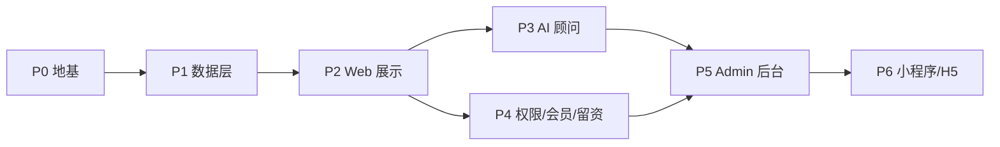

# roadmap.md — 开发路线图与任务卡清单

> 本文件是整体**开发编排的唯一来源**：分阶段依赖、任务卡拆分、人工确认关口。
> 编排由人工把关，Codex 按任务卡逐张执行（AGENTS.md §6「小步交付」、§12「一个任务卡 = 一个 PR」、§13 自检）。
> 数据/接口/覆盖等级/双语/权限/AI 细节以对应 `docs/` 文档为准，本文件不重复定义。

---

## 0. 编排原则

1. **依赖驱动**：地基 → 数据 → 展示 → 智能 → 转化。上游未完成不开工下游。
2. **一张任务卡 = 一个 PR = 一件事**，附测试，独立可验收、可回滚。
3. **人工确认关口**（AGENTS.md §11）在下文用 ⚠️ 标注，Codex 遇到必须停下等 Review。
4. **两处待定项**（AI 系统 Prompt 正式文本、检索边界参数默认值）先用占位跑通管道，定稿后替换，不阻塞开发（见 [ai-advisor.md §4/§5](./ai-advisor.md)）。

---

## 1. 阶段依赖总览

| 阶段 | 目标 | 主要依据文档 | 关口 |
|------|------|--------------|------|
| P0 地基 | 可运行骨架 + 共享枚举/双语工具 + 环境/CI/文档守卫 | env-config、i18n、testing、data-schema、product-brief | — |
| P1 数据层 | 数据模型落地 + 数据治理校验 + 印尼样板 + 覆盖判定 | data-schema、coverage-levels、data-governance、indonesia-seed、country-rollout | ⚠️ |
| P2 Web 展示 | 首页 / 国家 / AI 咨询 / 报告四板块 + i18n | product-brief、api-contract、coverage-levels、i18n | — |
| P3 AI 顾问 | RAG 管道 + 问答接口（占位边界） | ai-advisor | ⚠️ |
| P4 权限/会员/留资 | 门控 + 报告下载 + 留资 | auth-membership | ⚠️ |
| P5 Admin 后台 | 数据管理 + 审核发布 + AI/报告/线索运营 | api-contract、data-schema、data-governance | ⚠️ |
| P6 小程序/H5 | 轻入口复用双语 | i18n | — |

---

## 2. 任务卡清单

> 每张卡格式：**目标 / 涉及范围 / 验收标准 / 是否触及「需人工确认」**。
> 任务 ID 用于分支与 PR 命名：`feat/<task-id>-<简述>`（AGENTS.md §12）。

### P0 — 地基

#### P0-1 Monorepo 骨架
- 目标：pnpm workspace + Turborepo，建 `apps/{web,admin,mini}`、`packages/{db,shared-types,ai-advisor}`、`data/` 空目录。
- 验收：`pnpm install` 通过；根脚本含 `lint` / `typecheck` / `test` / `test:e2e`；TS strict 开启；`packageManager` 固定为 pnpm；目录结构与 AGENTS.md §4 一致。
- 人工确认：否（技术栈已在 AGENTS.md 固定，不得替换）。

#### P0-2 共享类型、固定枚举与双语工具
- 目标：`packages/shared-types` 定义 `Locale`、`LocalizedText`、`pickLocale()`（[i18n.md §5](./i18n.md)）以及 `data-schema.md` 固定枚举（模块、覆盖等级、模块状态、审核状态、可信度、标签、地区、访问等级）。
- 验收：`pickLocale` 三种缺失分支单测通过（缺 zh / 缺 en / 全缺）；枚举 key 与 [data-schema.md §1/§5.10/§7](./data-schema.md) 完全一致；各端禁止重复定义国家/数据模型枚举。
- 人工确认：否。

#### P0-3 环境配置与校验
- 目标：`.env.example` 按 [env-config.md §2](./env-config.md) 全量字段；共享环境校验函数；`.gitignore` 含 `.env*`。
- 验收：缺必需变量 fail-fast 且不泄露值；前端公开变量不含服务端密钥；新增变量必须同时更新 `env-config.md`、`.env.example` 与校验测试。
- 人工确认：否（引入需新密钥的三方依赖时才 ⚠️）。

#### P0-4 CI 门槛
- 目标：CI 跑 `pnpm install --frozen-lockfile`、`pnpm lint`、`pnpm typecheck`、`pnpm test`；保留 `pnpm test:e2e` 门槛；加入基础文档范围 smoke test。
- 验收：CI 绿；无测试的改动被拦；`AGENTS.md`、`product-brief.md`、`roadmap.md`、`testing.md`、`api-contract.md` 对 MVP 四板块与国家对比 Deferred 的描述不互相冲突。
- 人工确认：否。

### P1 — 数据层 ⚠️

> P1-1 至 P1-3 是 P2 Web 展示的技术前置；P1-4 是国家扩展计划与人工确认清单，不落库，不阻塞 P2。

#### P1-1 Prisma schema（数据模型落地）⚠️
- 目标：按 [data-schema.md](./data-schema.md) 建 `packages/db` schema：`Country`、`ModuleCoverage`、10 模块、`KnowledgeChunk`（pgvector）、`Lead`，枚举与元字段齐全。
- 验收：schema 与 data-schema 完全一致；迁移可执行；`shared-types` 与 schema 枚举一致；报告 `accessLevel`、`Lead.contact` 按 data-schema §6 加密存储、知识片段双语向量字段齐全；不得新增评分/国家计划持久化字段，若需新增字段必须先改 `data-schema.md`。
- 人工确认：**是（修改统一数据模型，AGENTS.md §11）** —— PR 标注。

#### P1-2 印尼样板 seed 与数据治理校验
- 目标：`data/indonesia/` 按 [indonesia-seed.md](./indonesia-seed.md) 填充至 COMPLETE；实现 seed 导入与 [data-governance.md](./data-governance.md) 数据质量校验。
- 验收：seed 校验通过（双语齐全、元字段齐全、来源/可信度合法、枚举合法、`countryCode=ID`）；缺元字段不得入库；`draft` / `pending` / `UNVERIFIED` 反例不进入 C 端展示、覆盖判定或 AI 检索；报告 `accessLevel` 合法；印尼判定为 COMPLETE。
- 人工确认：否（不改结构；改结构须回 P1-1）。

#### P1-3 覆盖等级判定逻辑
- 目标：实现 [coverage-levels.md §3](./coverage-levels.md) 的模块级 + 国家级判定，计数口径按 C 端可展示数据（`published` 且 `credibility != UNVERIFIED`）。
- 验收：阈值边界单测覆盖；`draft` / `pending` / `UNVERIFIED` 不计入覆盖判定计数；对象型模块按核心字段填充率判定；`ai-advisor` 按可用知识片段判定；印尼样板判定为 COMPLETE。
- 人工确认：否。

#### P1-4 首批国家建设计划与复制模板
- 目标：按 [country-rollout.md](./country-rollout.md) 与 [indonesia-seed.md §5](./indonesia-seed.md) 整理国家建设计划、覆盖升级节奏与从印尼复制到新国家的 seed 模板规则，不落库。
- 验收：Complete / Standard / Basic 候选与人工确认项清晰；不得把国家优先级、覆盖升级结论、评分结果写入持久化字段；后续新增国家 seed 必须独立任务卡、独立验收。
- 人工确认：否（仅文档候选；最终 30–50 国家清单、优先级与升级结论须人工确认）。

### P2 — Web 展示

#### P2-1 i18n 框架接入
- 目标：`apps/web` 接 `next-intl`，`/[locale]/...` 路由，`locales/{zh-CN,en}.json` 骨架 + §3.3 固定 key。
- 验收：key 对齐测试通过；语言切换持久化；无硬编码文案。
- 人工确认：否。

#### P2-2 国家列表 / 地图
- 目标：`GET /countries` + 国家板块列表/地图页，支持地区/标签/覆盖等级筛选。
- 验收：筛选生效；卡片显示覆盖等级徽章、更新时间与重点信号；E2E 通过。
- 人工确认：否。

#### P2-3 国家详情（十模块骨架）
- 目标：`GET /countries/:code` + `/modules/:moduleKey`，详情页渲染十模块；`BUILDING` 显示占位不报错。
- 验收：印尼十模块正常渲染；`BUILDING` 模块占位；`textMode` 与 `_i18nFallback` 正确；E2E 通过。
- 人工确认：否。

#### P2-4 首页 / AI 咨询 / 报告入口
- 目标：按 [product-brief.md](./product-brief.md) 建立四板块 Web 信息架构：首页、国家、AI 咨询、报告。
- 验收：顶层导航仅包含四板块；首页突出重点信号不过度堆数据；AI 与报告入口符合权限和 AI 红线；E2E 通过。
- 人工确认：否。

#### P2-5 国家重点信号展示
- 目标：按 [scoring-framework.md](./scoring-framework.md) 展示机会、风险、政策友好度、推荐优先级等派生信号。
- 验收：数据不足时显示建设中/证据不足；信号可追溯来源与更新时间；不新增持久化字段；单测覆盖派生规则。
- 人工确认：否。

### P3 — AI 顾问 ⚠️

#### P3-1 RAG 离线管道
- 目标：按 [ai-advisor.md §2](./ai-advisor.md) 实现 published→过滤→分块→双语向量化→写 `KnowledgeChunk`；数据失效同步。
- 验收：硬过滤单测（draft/pending/UNVERIFIED 不入库或不可检索）；来源溯源保留。
- 人工确认：否（管道实现，不定义边界）。

#### P3-2 问答接口 `POST /ai/ask`
- 目标：按 [api-contract.md §5](./api-contract.md) 实现在线检索 + 生成；系统 Prompt / 检索边界用**占位常量**并标注 `TODO`。
- 验收：回答含 sources/updatedAt/riskNote；空数据答 `ai.noData`；语言一致；注入防护、限流生效。
- 人工确认：**是（系统 Prompt 正式文本、检索边界默认值待人工定稿，AGENTS.md §9/§11）** —— 先占位跑通，定稿后单独 PR 替换。

### P4 — 权限 / 会员 / 留资 ⚠️

#### P4-1 鉴权与门控
- 目标：按 [auth-membership.md](./auth-membership.md) 实现 JWT 鉴权守卫 + 等级校验 + 门控矩阵。
- 验收：受控资源等级不足→403、未登录→401；越权用例不能绕过。
- 人工确认：**是（会员/计费/权限逻辑，AGENTS.md §11）** —— PR 标注。

#### P4-2 报告下载
- 目标：`GET /countries/:code/reports/:id/download`，按资源 `accessLevel` 服务端复核 + 短时效绑定用户链接。
- 验收：等级矩阵放行/拒绝正确；链接不可公开枚举。
- 人工确认：是（同 P4-1 权益相关）。

#### P4-3 留资
- 目标：`POST /leads`，`contact` 加密存储、不回显。
- 验收：字段校验；加密写入；响应/日志无敏感明文。
- 人工确认：否。

### P5 — Admin 后台

#### P5-1 数据管理工作台
- 目标：Refine 后台管理国家、10 模块数据、标签与覆盖状态；支持 `textMode=raw` 双语编辑。
- 验收：仅 ADMIN 可访问；双语字段、元字段、枚举校验齐全；无国家特例。
- 人工确认：否（不改模型；如需改则回 P1-1）。

#### P5-2 审核发布流
- 目标：Refine 后台，数据 draft→pending→published；支持 `textMode=raw` 双语编辑；`aiUsable` 控制。
- 验收：仅 ADMIN 可访问；发布后方进入 C 端与 AI 检索；双语可编辑。
- 人工确认：否（不改模型/边界；如需改则回相应关口）。

#### P5-3 AI 知识库运营
- 目标：后台查看知识片段生成状态、来源、更新时间与可检索状态。
- 验收：取消发布或关闭 `aiUsable` 后不可检索；异常状态可见；不放宽 AI 检索边界。
- 人工确认：否（如修改系统 Prompt 或检索边界则 ⚠️）。

#### P5-4 报告与数据包运营
- 目标：后台管理报告条目、访问等级、下载资源与国家数据包展示信息。
- 验收：受控资源权限配置完整；不暴露真实文件地址；双语信息完整。
- 人工确认：是（报告权益、会员等级、计费边界）。

#### P5-5 线索运营
- 目标：后台查看留资来源、国家兴趣、跟进状态；敏感联系方式按权限显示。
- 验收：仅授权角色可查看敏感字段；日志不输出明文联系方式。
- 人工确认：否（如新增销售权限/计费规则则 ⚠️）。

### P6 — 小程序 / H5

#### P6-1 Taro 轻入口
- 目标：`apps/mini` 复用同一套 i18n key 与双语数据，提供国家浏览 + 留资。
- 验收：key 与 Web 一致；双语切换正常；留资走同一后端。
- 人工确认：否。

---

## 3. 两处待定项处理约定

| 待定项 | 依据 | 开发期处理 | 定稿后 |
|--------|------|------------|--------|
| AI 系统 Prompt 正式文本 | [ai-advisor.md §4](./ai-advisor.md) | 占位常量 + 代码 `TODO` | 人工定稿 → 单独 PR 替换（⚠️） |
| 检索边界默认值（`topK`/`minSimilarity`/跨国跨模块） | [ai-advisor.md §5](./ai-advisor.md) | 可配置参数 + 保守默认 | 人工确认默认值 → 更新配置（⚠️） |

> 两者均不阻塞 P3 管道跑通；Codex **不得自行编写正式 Prompt 或放宽检索范围**。

---

## 4. Deferred / Backlog

| 能力 | 暂缓原因 | 恢复条件 |
|------|----------|----------|
| 国家对比 | MVP 顶层信息架构已调整为首页 / 国家 / AI 咨询 / 报告，先降低复杂度 | 重新确认产品优先级后，同步更新 `api-contract.md` 与 `testing.md` |
| 全局政策 / 风险 / 项目 / 伙伴独立库 | MVP 先通过国家详情承载模块数据，避免信息过密 | 当数据规模与筛选需求足够明确后拆任务卡 |
| 自动生成报告 | 涉及报告模板、AI 边界、权限和人工审核 | 补充报告生成规范与人工审核流程 |
| 国家数据包售卖 | 涉及权益、计费、下载安全 | 完成会员/权限人工确认 |
| 渠道增长自动化 | 属于运营系统，不阻塞核心产品 | 线索与会员闭环跑通后拆分 |

---

## 5. 每张任务卡的通用验收（AGENTS.md §13）

- [ ] 未破坏统一数据模型 / 未写国家特例
- [ ] 新增数据带齐元字段
- [ ] UI 走 i18n key、中英对齐；业务展示字段用 `LocalizedText` 且处理降级
- [ ] 无硬编码国家名/密钥/文案
- [ ] 附测试，本地 `pnpm lint && typecheck && test` 通过
- [ ] 触及「需人工确认」项已在 PR 标注
- [ ] 改动范围与任务卡一致，无越界
